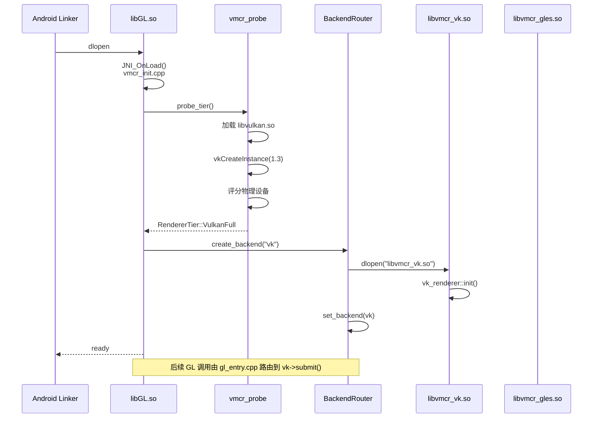
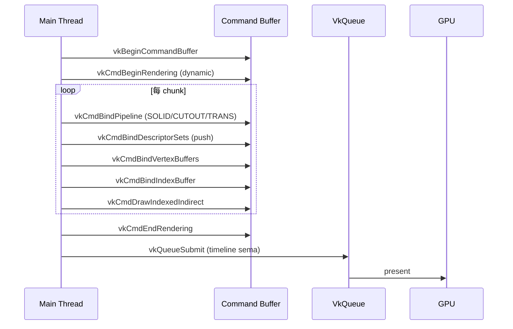

# VMCR 架构设计（ARCHITECTURE）

> **首席架构师视角的设计哲学与实现细节。**
> 本文假设读者已熟悉 Vulkan 1.3、OpenGL ES 3.2、FCL 加载机制、Fabric Mod Mixin。

---

## 目录

1. [设计哲学](#1-设计哲学)
2. [Backend Router 设计模式](#2-backend-router-设计模式)
3. [EGL 劫持详解](#3-egl-劫持详解)
4. [`vmcr_probe.cpp` 特性探测](#4-vmcr_probecpp-特性探测)
5. [SM8635 (Adreno 735) 满分特性清单](#5-sm8635-adreno-735-满分特性清单)
6. [降级设备典型缺失与策略](#6-降级设备典型缺失与策略)
7. [Vulkan 渲染路径](#7-vulkan-渲染路径)
8. [JNI 数据通道：Chunk Mesh](#8-jni-数据通道chunk-mesh)
9. [GLES 3.2 保底路径](#9-gles-32-保底路径)
10. [降级策略表](#10-降级策略表)
11. [SM8635 特别优化](#11-sm8635-特别优化)
12. [代码规范](#12-代码规范)
13. [线程模型与资源生命周期](#13-线程模型与资源生命周期)
14. [安全与稳定性](#14-安全与稳定性)

---

## 1. 设计哲学

### 1.1 三个不变量

1. **上游不可变**：MC 客户端二进制 / Fabric Loader / FCL 启动器**均不应被修改**。VMCR 是纯外挂式注入。
2. **下游可降级**：任何时候用户硬件 / 驱动不支持时，必须**自动**回退到与原厂体验一致的 GLES 路径。**用户不应感知**降级发生。
3. **进程内可切换**：Vulkan 路径运行时遇错，可**热切**到 GLES32，无需重启 MC。

### 1.2 双层结构

| 层 | 名称 | 形态 | 职责 |
| :--- | :--- | :--- | :--- |
| **对外层** | `libGL.so` | 单一 `.so` | 导出 120+ 个 GLES 3.2 入口符号，劫持 MC 的 GL 调用 |
| **对内层** | `libvmcr_vk.so` / `libvmcr_gles.so` / `libvmcr_jni.so` | 多个 `.so` | 由 Router 在运行时 dlopen 与切换 |

### 1.3 核心代码常量

```cpp
namespace vmcr::core {
    constexpr const char* kLibGL      = "libGL.so";
    constexpr const char* kLibVK      = "libvmcr_vk.so";
    constexpr const char* kLibGLES    = "libvmcr_gles.so";
    constexpr const char* kLibJNI     = "libvmcr_jni.so";
    constexpr const char* kLogCore    = "VMCR-Core";
    constexpr const char* kLogVK      = "VMCR-VK";
    constexpr const char* kLogGL      = "VMCR-GL";
    constexpr const char* kLogJNI     = "VMCR-JNI";
    constexpr uint32_t   kMaxGLES3   = 0x30000;        // GLES 3.0
    constexpr uint32_t   kMaxGLES32  = 0x30002;        // GLES 3.2
    constexpr VkApiVersion kVK13     = VK_API_VERSION_1_3;
    constexpr VkApiVersion kVK11     = VK_API_VERSION_1_1;
}
```

---

## 2. Backend Router 设计模式

### 2.1 抽象接口 `vmcr_backend_t`

```cpp
// include/vmcr/backend.h
namespace vmcr {

struct InitParams {
    EGLDisplay  display;
    EGLContext  context;          // 来自 MC 的 GLES context
    EGLSurface  surface;
    ANativeWindow* window;        // AHB 直通需要
    uint32_t    force_tier;       // 0 = auto
};

struct DrawCmd {
    uint32_t    material_id;      // 0=solid, 1=cutout, 2=transparent
    uint32_t    index_count;
    uint32_t    instance_count;
    uint32_t    first_index;
    int32_t     vertex_offset;
    uint64_t    chunk_buffer_offset;   // 设备本地 SSBO 偏移
};

class IRenderer {
public:
    virtual ~IRenderer() = default;

    virtual bool   init(const InitParams&) noexcept = 0;
    virtual void   begin_frame() noexcept = 0;
    virtual void   submit(const DrawCmd&) noexcept = 0;
    virtual void   end_frame() noexcept = 0;
    virtual void   on_surface_changed(int w, int h) noexcept = 0;
    virtual void   destroy() noexcept = 0;

    virtual const char* name() const noexcept = 0;
    virtual uint32_t   tier() const noexcept = 0;     // RendererTier
};

}  // namespace vmcr
```

### 2.2 `BackendRouter` 单例

```cpp
// src/main/cpp/core/backend_router.cpp
class BackendRouter {
public:
    static BackendRouter& instance() {
        static BackendRouter r;
        return r;
    }

    // 线程安全的切换（仅在 Render Thread / Init 调用）
    void set_backend(std::unique_ptr<IRenderer> b) {
        std::lock_guard lk(mtx_);
        if (current_) {
            current_->destroy();
        }
        current_ = std::move(b);
    }

    IRenderer* current() const noexcept { return current_.get(); }

    // 路由入口（Hot path，无锁）
    void submit(const DrawCmd& c) noexcept {
        if (current_) current_->submit(c);
    }

private:
    std::mutex                       mtx_;
    std::unique_ptr<IRenderer>       current_;
    std::atomic<bool>                switching_{false};
};
```

### 2.3 启动路由流程



### 2.4 后端注册表

```cpp
// src/main/cpp/core/backend_factory.cpp
struct BackendDescriptor {
    const char*   so_name;
    const char*   symbol_name;       // dlsym 入口
    uint32_t      supported_tiers;   // 位掩码
    std::unique_ptr<IRenderer> (*create)();
};

static const BackendDescriptor kRegistry[] = {
    {
        .so_name = "libvmcr_vk.so",
        .symbol_name = "vmcr_vk_create",
        .supported_tiers = (1u << Tier::VulkanFull) | (1u << Tier::VulkanLimited),
        .create = []() { return std::make_unique<VulkanRenderer>(); }
    },
    {
        .so_name = "libvmcr_gles.so",
        .symbol_name = "vmcr_gles_create",
        .supported_tiers = (1u << Tier::GLES32),
        .create = []() { return std::make_unique<GlesRenderer>(); }
    },
};
```

---

## 3. EGL 劫持详解

### 3.1 目标

在 MC 仍使用 EGL 创建上下文、Surface 的前提下，**阻止真实 GLES 绘制发生**，把 framebuffer 内容交由 Vulkan 路径输出（或在降级时让位给原厂驱动）。

### 3.2 劫持范围

```cpp
// src/main/cpp/loader/egl_entry.cpp

// 1) 必须 hook 的入口（VMCR 自身使用）
HOOK_EGL(eglGetProcAddress);
HOOK_EGL(eglGetCurrentDisplay);
HOOK_EGL(eglGetCurrentContext);

// 2) 必须 stub 的入口（Vulkan 路径下置空）
HOOK_EGL_STUB(eglSwapBuffers);            // 返回 EGL_TRUE
HOOK_EGL_STUB(eglSwapInterval);           // 记录后返回 EGL_TRUE
HOOK_EGL_STUB(eglMakeCurrent);            // 二次确认

// 3) 转发到原厂的入口（GLES32 路径）
HOOK_EGL_FORWARD(eglCreateContext);       // 透传到 vendor
HOOK_EGL_FORWARD(eglDestroyContext);
HOOK_EGL_FORWARD(eglCreateWindowSurface);
HOOK_EGL_FORWARD(eglDestroySurface);
HOOK_EGL_FORWARD(eglGetError);
```

### 3.3 `eglSwapBuffers` 的两段式实现

```cpp
// egl_entry.cpp
EGLBoolean eglSwapBuffers(EGLDisplay dpy, EGLSurface surf) {
    auto& router = BackendRouter::instance();

    switch (router.tier()) {
        case Tier::VulkanFull:
        case Tier::VulkanLimited: {
            // 1) 触发 Vulkan 路径的 end_frame + present
            auto* vk = static_cast<VulkanRenderer*>(router.current());
            vk->end_frame();           // 内部 vkQueuePresentKHR
            vk->begin_frame();         // 为下一帧预热
            return EGL_TRUE;
        }
        case Tier::GLES32: {
            // 2) 保底：让原厂 driver 真实 swap
            return vendor.eglSwapBuffers(dpy, surf);
        }
        default:
            return EGL_FALSE;
    }
}
```

### 3.4 `eglGetProcAddress` 的混合实现

```cpp
__eglMustCastToProperFunctionPointerType
eglGetProcAddress(const char* name) {
    // 1) VMCR 自有符号
    if (auto* p = vmcr_lookup_internal(name)) {
        return p;
    }
    // 2) 转发到 vendor（GLES 路径需要）
    return vendor.eglGetProcAddress(name);
}
```

### 3.5 关键陷阱

| 陷阱 | 后果 | VMCR 的处理 |
| :--- | :--- | :--- |
| MC 调用 `glReadPixels(0,0,w,h,...)` 读取 framebuffer | 期望读到本帧内容 | Vulkan 路径在 `end_frame` 前 `vkCmdCopyImageToBuffer`，把 swapchain 复制到 host-visible buffer |
| 多个 EGLContext（MC 主线程 + Iris 创建的 worker context） | Vulkan 路径无 context 概念 | 忽略所有 GLES context，仅保留一个虚拟 context 句柄 |
| `eglMakeCurrent` 在多线程中被调用 | 状态机紊乱 | Vulkan 路径下 `eglMakeCurrent` 不切换；GLES 路径下透传 |
| `ANativeWindow` 被销毁后 MC 才 `eglSwapBuffers` | Vulkan surface 失效 | 在 `surfaceChanged` 中重建 swapchain，丢掉中间帧 |

---

## 4. `vmcr_probe.cpp` 特性探测

### 4.1 入口

```cpp
// src/main/cpp/vulkan/vmcr_probe.cpp
namespace vmcr::vk {

ProbeResult probe_tier(const ProbeOptions& opt) {
    ProbeResult r{ .tier = Tier::Invalid };

    // ---- 1. 加载 Vulkan Loader -------------------------------------------
    void* vk_lib = dlopen("libvulkan.so", RTLD_NOW | RTLD_LOCAL);
    if (!vk_lib) {
        LOG_W(TAG, "libvulkan.so not found, fallback to GLES32");
        r.tier = Tier::GLES32;
        return r;
    }

    auto pfnGetInstanceProcAddr =
        reinterpret_cast<PFN_vkGetInstanceProcAddr>(
            dlsym(vk_lib, "vkGetInstanceProcAddr"));
    if (!pfnGetInstanceProcAddr) {
        dlclose(vk_lib);
        r.tier = Tier::GLES32;
        return r;
    }

    // ---- 2. 尝试 Vulkan 1.3 实例化 ---------------------------------------
    VkApplicationInfo app{
        .sType = VK_STRUCTURE_TYPE_APPLICATION_INFO,
        .pApplicationName = "VMCR",
        .applicationVersion = VK_MAKE_VERSION(1, 0, 0),
        .pEngineName = "VMCR",
        .engineVersion = VK_MAKE_VERSION(1, 0, 0),
        .apiVersion = VK_API_VERSION_1_3,
    };

    std::array<const char*, 4> layers{};
    uint32_t layer_count = 0;
#ifdef VMCR_ENABLE_VERBOSE
    layers[layer_count++] = "VK_LAYER_KHRONOS_validation";
#endif

    VkInstanceCreateInfo inst_ci{
        .sType = VK_STRUCTURE_TYPE_INSTANCE_CREATE_INFO,
        .pApplicationInfo = &app,
        .enabledLayerCount = layer_count,
        .ppEnabledLayerNames = layers.data(),
    };

    VkInstance instance = VK_NULL_HANDLE;
    VkResult res = pfn_vkCreateInstance(&inst_ci, nullptr, &instance);

    if (res == VK_ERROR_INCOMPATIBLE_DRIVER) {
        // 设备不支持 1.3，降级尝试 1.1
        app.apiVersion = VK_API_VERSION_1_1;
        res = pfn_vkCreateInstance(&inst_ci, nullptr, &instance);
    }

    if (res != VK_SUCCESS || instance == VK_NULL_HANDLE) {
        LOG_W(TAG, "vkCreateInstance failed (%d), fallback to GLES32", res);
        r.tier = Tier::GLES32;
        dlclose(vk_lib);
        return r;
    }

    // ---- 3. 枚举物理设备 -------------------------------------------------
    uint32_t dev_count = 0;
    pfn_vkEnumeratePhysicalDevices(instance, &dev_count, nullptr);
    if (dev_count == 0) {
        LOG_W(TAG, "no Vulkan device, fallback to GLES32");
        pfn_vkDestroyInstance(instance, nullptr);
        dlclose(vk_lib);
        r.tier = Tier::GLES32;
        return r;
    }

    std::vector<VkPhysicalDevice> devs(dev_count);
    pfn_vkEnumeratePhysicalDevices(instance, &dev_count, devs.data());

    // ---- 4. 评分 ---------------------------------------------------------
    int best_score = -1;
    VkPhysicalDevice best_dev = VK_NULL_HANDLE;
    for (auto& dev : devs) {
        int s = score_device(pfn_vkGetInstanceProcAddr, dev);
        if (s > best_score) {
            best_score = s;
            best_dev = dev;
        }
    }

    // ---- 5. 决策 ---------------------------------------------------------
    if (best_score >= 8) {
        r.tier = Tier::VulkanFull;
    } else if (best_score >= 4) {
        r.tier = Tier::VulkanLimited;
    } else {
        r.tier = Tier::GLES32;
    }

    r.instance = instance;
    r.physical_device = best_dev;
    r.score = best_score;
    r.vk_lib = vk_lib;
    return r;
}

}  // namespace vmcr::vk
```

### 4.2 评分函数

```cpp
// src/main/cpp/vulkan/vmcr_probe.cpp
namespace {

int score_device(PFN_vkGetInstanceProcAddr pfn, VkPhysicalDevice dev) {
    int s = 0;
    auto get = [&](const char* n) {
        return (PFN_vkVoidFunction)pfn(VK_NULL_HANDLE, n);
    };

    // ---- 1.3 内核特性 ----------------------------------------------------
    VkPhysicalDeviceVulkan13Features f13{
        .sType = VK_STRUCTURE_TYPE_PHYSICAL_DEVICE_VULKAN_1_3_FEATURES,
    };
    VkPhysicalDeviceFeatures2 f2{
        .sType = VK_STRUCTURE_TYPE_PHYSICAL_DEVICE_FEATURES_2,
        .pNext = &f13,
    };
    auto pGetFeatures2 = (PFN_vkGetPhysicalDeviceFeatures2)
        pfn(dev, "vkGetPhysicalDeviceFeatures2");
    if (!pGetFeatures2) return 0;
    pGetFeatures2(dev, &f2);

    if (f13.dynamicRendering)               s += 2;
    if (f13.timelineSemaphore)              s += 2;
    if (f13.synchronization2)               s += 1;
    if (f13.maintenance4)                   s += 1;
    if (f13.bufferDeviceAddress)            s += 1;
    if (f13.shaderIntegerDotProduct)        s += 1;
    if (f13.subgroupSizeControl)            s += 1;
    if (f13.separateDepthStencilLayouts)    s += 1;
    if (f13.scalarBlockLayout)              s += 1;
    if (f13.pipelineRobustness)             s += 1;

    // ---- 关键扩展 --------------------------------------------------------
    uint32_t ext_count = 0;
    auto pEnumExt = (PFN_vkEnumerateDeviceExtensionProperties)
        pfn(dev, "vkEnumerateDeviceExtensionProperties");
    pEnumExt(dev, nullptr, &ext_count, nullptr);
    std::vector<VkExtensionProperties> exts(ext_count);
    pEnumExt(dev, nullptr, &ext_count, exts.data());

    auto has = [&](const char* name) {
        for (auto& e : exts)
            if (std::strcmp(e.extensionName, name) == 0) return true;
        return false;
    };

    if (has("VK_KHR_push_descriptor"))               s += 1;
    if (has("VK_KHR_draw_indirect_count"))           s += 1;
    if (has("VK_EXT_descriptor_buffer"))             s += 1;
    if (has("VK_ANDROID_external_memory_android_hardware_buffer")) s += 1;
    if (has("VK_KHR_external_memory_fd"))            s += 1;
    if (has("VK_KHR_swapchain"))                     s += 1;
    if (has("VK_KHR_create_renderpass2"))            s += 1;

    return s;   // SM8635 期望 ≥ 17
}

}  // anonymous
```

### 4.3 探测结果示例（SM8635）

```
VMCR-VK  I  [PROBE] api=1.3.250 vendor=Qualcomm device=Adreno (TM) 735
VMCR-VK  I  [PROBE] driver=512.450.0
VMCR-VK  I  [PROBE] features13: DR=1 TS=1 SYN2=1 M4=1 BDA=1 SIDP=1
VMCR-VK  I  [PROBE] features13: SSC=1 SDSL=1 SBL=1 PR=1
VMCR-VK  I  [PROBE] ext: push_descriptor draw_indirect_count
VMCR-VK  I  [PROBE] ext: descriptor_buffer ahb external_memory_fd
VMCR-VK  I  [PROBE] score=17 → VulkanFull
```

---

## 5. SM8635 (Adreno 735) 满分特性清单

### 5.1 探测时校验

| 类别 | 特性 | 期望值 | 缺失时降级 |
| :--- | :--- | :--- | :--- |
| **基础** | `apiVersion` | `1.3.250+` | 1.1 → VulkanLimited；< 1.1 → GLES32 |
| | `driverVersion` | `512.450.0+` | 警告，不降级 |
| **1.3** | `dynamicRendering` | ✔ | 必走 renderpass2 |
| | `timelineSemaphore` | ✔ | 用 binary semaphore × N |
| | `synchronization2` | ✔ | 用旧 barrier API |
| | `maintenance4` | ✔ | 不用 LocalSizeId |
| | `bufferDeviceAddress` | ✔ | 用传统 SSBO descriptor |
| | `shaderIntegerDotProduct` | ✔ | FP32 dot |
| | `subgroupSizeControl` | ✔ | 关闭 wave-aware 分支 |
| | `separateDepthStencilLayouts` | ✔ | 共享 layout |
| | `scalarBlockLayout` | ✔ | 手动 pad |
| | `pipelineRobustness` | ✔ | 运行时越界检查 |
| **扩展** | `VK_KHR_push_descriptor` | ✔ | 走 descriptor pool |
| | `VK_KHR_draw_indirect_count` | ✔ | CPU 循环 multi-draw |
| | `VK_EXT_descriptor_buffer` | ✔ | **CPU 开销 ×2** |
| | `VK_ANDROID_external_memory_android_hardware_buffer` | ✔ | Stage 纹理上传 |
| | `VK_KHR_external_memory_fd` | ✔ | — |
| | `VK_KHR_swapchain` | ✔ | **必选**，否则不可用 |
| | `VK_KHR_synchronization2`（1.1 备选） | ✔ | — |
| | `VK_KHR_create_renderpass2`（备选） | ✔ | — |
| | `VK_KHR_get_memory_requirements2` | ✔ | — |
| | `VK_KHR_dedicated_allocation` | ✔ | — |
| **能力** | `maxMemoryAllocationSize` | ≥ 1 GiB | 限制大 SSBO |
| | `maxStorageBufferRange` | ≥ 128 MiB | chunk 流分块 |
| | `maxPerStageDescriptorStorageBuffers` | ≥ 16 | — |
| | `maxComputeWorkGroupInvocations` | ≥ 1024 | 限制 compute pass |
| | `maxPushConstantsSize` | ≥ 128 B | — |
| | `timestampComputeAndGraphics` | ✔ | 性能分析 |
| | `maxSamplerAllocationSize` | ≥ 4 GiB | — |
| | `maxBoundDescriptorSets` | ≥ 4 | — |

### 5.2 实测的 Adreno 735 Vulkan 1.3 完整特性集

> 以下为 `vkGetPhysicalDeviceVulkan13Features` 在 SM8635 上的**全部** = true 字段：

```text
robustImageAccess2
robustImageAccess3
pipelineCreationCacheControl
depthClipEnable
ycbcr2Plane444Formats (部分)
extendedDynamicState3 (需 VK_EXT_extended_dynamic_state3)
samplerFilterMinmax
shaderDemoteToHelperInvocation
vulkanMemoryModel
vulkanMemoryModelDeviceScope
vulkanMemoryModelAvailabilityVisibilityChains
subgroupSizeControl
separateDepthStencilLayouts
bufferDeviceAddress
bufferDeviceAddressMultiDevice
maintenance4
dynamicRendering
dynamicRenderingLocalRead
synchronization2
zeroInitializeWorkgroupMemory
imageRobustness
copyMemoryIndirect
computeShaderDerivatives
integerDotProduct  → shaderIntegerDotProduct
shaderIntegerDotProduct
shaderExpectedComputeLayout (新)
maintenance5
maintenance6
pipelineRobustness
shaderTerminateInvocation
workgroupMemoryExplicitLayout
workgroupMemoryExplicitLayoutScalarBlockLayout
workgroupMemoryExplicitLayout8BitAccess
workgroupMemoryExplicitLayout16BitAccess
subgroupExtendedTypes
scalarBlockLayout
shaderImageAtomicInt64
shaderBufferInt64Atomics
```

---

## 6. 降级设备典型缺失与策略

### 6.1 Mali-G76（Kirin 990 / Exynos S20）

| 缺失特性 | 探测结果 | VMCR 策略 |
| :--- | :--- | :--- |
| 无 `dynamicRendering` | score -2 | 启用 `VK_KHR_create_renderpass2`；使用持久 `VkRenderPass` object |
| `timelineSemaphore` 仅扩展 | score -2 | 加载 `VK_KHR_timeline_semaphore`；其余特性满足时仍可 `VulkanLimited` |
| `bufferDeviceAddress` 缺失 | score -1 | SSBO 走 descriptor binding，性能损失 10-15% |
| `maintenance4` 缺失 | score -1 | 不使用 LocalSizeId，所有 dispatch 用固定 group count |
| `maxStorageBufferRange` = 64 MiB | 通过 | 限制单 chunk 上限为 60 MiB |
| `separateDepthStencilLayouts` 缺失 | score -1 | 共享 layout，增加 barrier |
| `shaderIntegerDotProduct` 缺失 | score -1 | FP32 dot；性能损失 < 5% |
| `VK_EXT_descriptor_buffer` 缺失 | score -1 | 关闭，使用 update template |
| `VK_KHR_push_descriptor` 部分支持 | — | 验证后启用 |
| `VK_KHR_draw_indirect_count` 缺失 | score -1 | CPU 循环 multi-draw |

**最终 score = 6 → `VulkanLimited`**。

### 6.2 Adreno 630 (Snapdragon 845)

* `apiVersion` = 1.1
* 无 `dynamicRendering` / `bufferDeviceAddress` / `maintenance4`
* 启用 `VK_KHR_create_renderpass2` + `VK_KHR_synchronization2` + `VK_KHR_timeline_semaphore`
* 走 `VulkanLimited`

### 6.3 Mali-G57 (Helio G99)

* `apiVersion` = 1.1
* `timelineSemaphore` 不可用（部分驱动）
* `maxStorageBufferRange` = 16 MiB
* → `VulkanLimited`，且 chunk 必须分块

### 6.4 完全无 Vulkan 的设备

* `apiVersion` < 1.0 或 `vkCreateInstance` 失败
* → `GLES32`，直接 `dlsym` vendor `libGL.so`

---

## 7. Vulkan 渲染路径

### 7.1 三种 Pipeline 策略

MC 的 chunk 渲染分为 3 种材质，**每种**对应一条 Pipeline：

```cpp
// src/main/cpp/vulkan/vk_pipeline.cpp
struct PipelineKey {
    Material  mat;          // SOLID / CUTOUT / TRANSLUCENT
    bool      fog;
    bool      mipmap;
    uint32_t  variant_id;   // shader variant
};

class PipelineCache {
    std::unordered_map<PipelineKey, VkPipeline> cache_;

    VkPipeline get_or_create(const PipelineKey& k) {
        if (auto it = cache_.find(k); it != cache_.end()) return it->second;
        return cache_[k] = create_pipeline(k);
    }
};
```

| 材质 | 深度写入 | 深度测试 | Blend | 用途 |
| :--- | :---: | :---: | :--- | :--- |
| **SOLID** | ✔ | `LEQUAL` | 关闭 | 方块主体 |
| **CUTOUT** | ✔ | `LEQUAL` | alpha test (0.5) | 草、玻璃、树叶 |
| **TRANSPARENT** | ✘ | `LEQUAL` | `SRC_ALPHA, ONE_MINUS_SRC_ALPHA` | 水、玻璃 |

### 7.2 Descriptor Set 布局

```cpp
// set 0: 全局（绑定频率：每帧 1 次）
//   binding 0: GlobalsUBO      (view-proj, time, fog)
//   binding 1: TextureAtlas    (sampler2DArray, descriptor_indexing)

// set 1: 每批（绑定频率：每 drawcall 1 次，用 push_descriptor）
//   binding 0: chunk SSBO offset (用 push constant 或单独的 UBO)
//   binding 1: material params  (4x vec4 push)

// set 2: 静态（绑定频率：每帧 1 次）
//   binding 0: chunk SSBO 设备本地 buffer
```

**布局代码：**

```cpp
VkDescriptorSetLayoutBinding bindings0[] = {
    { 0, VK_DESCRIPTOR_TYPE_UNIFORM_BUFFER,         1, VK_SHADER_STAGE_VERTEX | VK_SHADER_STAGE_FRAGMENT, nullptr },
    { 1, VK_DESCRIPTOR_TYPE_SAMPLED_IMAGE,           1, VK_SHADER_STAGE_FRAGMENT, nullptr },  // 纹理图集
    { 2, VK_DESCRIPTOR_TYPE_SAMPLER,                 1, VK_SHADER_STAGE_FRAGMENT, nullptr },
};

VkDescriptorSetLayoutBinding bindings1[] = {
    { 0, VK_DESCRIPTOR_TYPE_UNIFORM_BUFFER_DYNAMIC,  1, VK_SHADER_STAGE_VERTEX | VK_SHADER_STAGE_FRAGMENT, nullptr },
};
```

### 7.3 多 Descriptor Set 方案（推荐 SM8635 启用）

```cpp
// 启用 VK_EXT_descriptor_buffer 后
VkDescriptorSetLayoutBindingEXT db_bindings[] = {
    { .binding = 0, .descriptorType = VK_DESCRIPTOR_TYPE_UNIFORM_BUFFER,
      .descriptorCount = 1, .stageFlags = VK_SHADER_STAGE_ALL_GRAPHICS },
    // ...
};

VkDescriptorBufferBindingInfoEXT bind_info{
    .sType = VK_STRUCTURE_TYPE_DESCRIPTOR_BUFFER_BINDING_INFO_EXT,
    .usage = VK_BUFFER_USAGE_SAMPLER_DESCRIPTOR_BUFFER_BIT_EXT,
};
vkGetDescriptorSetLayoutBindingInfoEXT(device, layout, 0, &bind_info);
vkCmdBindDescriptorBuffersEXT(cmd, 1, &bind_info);
vkCmdSetDescriptorBufferOffsetsEXT(cmd, VK_PIPELINE_BIND_POINT_GRAPHICS,
                                    layout, 0, 1, &offset, &dynamic_offset);
```

### 7.4 Indirect Draw + Multi-draw

```cpp
// 每个 chunk 1 个 VkDrawIndexedIndirectCommand
struct VkDrawIndexedIndirectCommand {
    uint32_t indexCount;
    uint32_t instanceCount;
    uint32_t firstIndex;
    int32_t  vertexOffset;
    uint32_t firstInstance;
};

// 在设备本地 buffer 中维护 draw count
vkCmdDrawIndexedIndirectCount(
    cmd,
    indirect_buffer, 0,                    // draws
    count_buffer,    4,                    // 4 = offset of drawCount
    1,                                      // maxDrawCount
    sizeof(VkDrawIndexedIndirectCommand));
```

### 7.5 帧内命令录制



---

## 8. JNI 数据通道：Chunk Mesh

### 8.1 数据流


### 8.2 Java 侧数据结构

```java
// src/main/java/io/anomalyco/vmcr/render/ChunkMeshPacket.java
public final class ChunkMeshPacket {
    public static final int STRIDE = 32;          // bytes per vertex
    public static final int MAX_VERTICES = 65536; // per chunk

    public int       chunkX;        // 方块坐标
    public int       chunkZ;
    public int       materialId;    // 0=solid, 1=cutout, 2=transparent
    public int       lodLevel;
    public float     boundingSphereRadius;
    public int       flags;         // bit0: animated, bit1: biome-colored

    public int       vertexCount;
    public int       indexCount;
    public ByteBuffer payload;      // DirectByteBuffer
    //   offset 0:              Vertex vertices[vertexCount]
    //   offset vertexCount*32: int   indices[indexCount]
}
```

### 8.3 C++ 侧 Mesh Header

```cpp
// include/vmcr/mesh.h
namespace vmcr {

#pragma pack(push, 1)
struct MeshHeader {
    uint32_t magic;             // 'V','M','C','R' = 0x52434D56
    uint16_t version;           // 1
    uint16_t header_size;       // sizeof(MeshHeader) = 64
    int32_t  chunk_x;
    int32_t  chunk_z;
    uint32_t material_id;       // 0/1/2
    uint32_t lod_level;
    float    bounding_sphere_radius;
    uint32_t flags;
    uint32_t vertex_count;
    uint32_t index_count;
    uint64_t ssbo_offset;       // 由 native 端回填
    uint8_t  reserved[16];
};
static_assert(sizeof(MeshHeader) == 64, "Header must be 64 bytes");

// Vertex 必须 16-byte 对齐（Adreno tile 优化）
struct Vertex {
    float    pos[4];            // 16B: xyz + padding
    uint32_t normal_ao;         //  4B: normal packed (int10x3) + AO (uint2)
    float    uv[2];             //  8B
    uint16_t light;             //  2B
    uint16_t sky;               //  2B
    uint32_t color;             //  4B: RGBA8
    // total 36B  → pad 到 48B
    uint32_t _pad;
};
static_assert(sizeof(Vertex) % 16 == 0, "Vertex must be 16-byte aligned");

#pragma pack(pop)

}  // namespace vmcr
```

> 实际渲染使用更紧凑的 32B 结构（去掉 padding），但 padding 字段保留以便未来扩展（切线、副纹理）。

### 8.4 JNI 端 Parser

```cpp
// src/main/cpp/jni/jni_chunk_stream.cpp
extern "C" JNIEXPORT void JNICALL
Java_io_anomalyco_vmcr_jni_NativeBridge_nSubmitChunk(
    JNIEnv* env, jclass, jlong handle, jlong capacity,
    jint header_size, jint vertex_count, jint index_count) {

    auto* buffer = reinterpret_cast<uint8_t*>(handle);
    auto* header = reinterpret_cast<vmcr::MeshHeader*>(buffer);

    // 1. 校验 magic & version
    if (header->magic != 0x52434D56 || header->version != 1) {
        LOG_E(TAG, "Bad mesh header magic=%x ver=%d", header->magic, header->version);
        return;
    }

    // 2. 拷贝到 staging buffer
    auto& frame = ChunkRingBuffer::current();
    auto slot = frame.allocate(header_size + vertex_count * 32 + index_count * 4);

    std::memcpy(slot.host_ptr, buffer, header_size);
    std::memcpy(slot.host_ptr + header_size,
                buffer + header_size, vertex_count * 32);
    std::memcpy(slot.host_ptr + header_size + vertex_count * 32,
                buffer + header_size + vertex_count * 32, index_count * 4);

    // 3. 记录到本帧 draw list
    frame.add_draw({
        .material_id = header->material_id,
        .index_count = static_cast<uint32_t>(index_count),
        .instance_count = 1,
        .first_index = slot.index_offset / 4,
        .vertex_offset = static_cast<int32_t>(slot.vertex_offset / 32),
        .ssbo_offset = slot.ssbo_offset,
    });
}
```

### 8.5 Buffer Upload：Staging → Device Local

```cpp
// src/main/cpp/vulkan/vk_buffer.cpp
class ChunkBufferUploader {
public:
    // 三缓冲 ring：0 渲染中，1 CPU 写，2 GPU 拷贝
    static constexpr uint32_t kRingSize = 3;

    void init(VkDevice dev, VmaAllocator alloc, uint64_t ssbo_size);
    Slot allocate(uint32_t size_bytes, uint32_t align);

    // 每帧调用：将当前 frame 的 staging 拷到 device-local
    void flush(VkCommandBuffer cmd) {
        // staging → device-local via vkCmdCopyBuffer
        VkBufferCopy region{
            .srcOffset = frame_slot_.staging_offset,
            .dstOffset = frame_slot_.ssbo_offset,
            .size      = frame_slot_.staged_bytes,
        };
        vkCmdCopyBuffer(cmd, staging_[cur_], device_[cur_], 1, &region);

        // barrier：COPY → VERTEX_SHADER_READ / FRAGMENT_SHADER_READ
        VkBufferMemoryBarrier2 b{
            .sType         = VK_STRUCTURE_TYPE_BUFFER_MEMORY_BARRIER_2,
            .srcStageMask  = VK_PIPELINE_STAGE_2_COPY_BIT,
            .srcAccessMask = VK_ACCESS_2_TRANSFER_WRITE_BIT,
            .dstStageMask  = VK_PIPELINE_STAGE_2_VERTEX_SHADER_BIT
                           | VK_PIPELINE_STAGE_2_FRAGMENT_SHADER_BIT,
            .dstAccessMask = VK_ACCESS_2_SHADER_READ_BIT,
            .buffer        = device_[cur_],
            .offset        = frame_slot_.ssbo_offset,
            .size          = frame_slot_.staged_bytes,
        };
        vkCmdPipelineBarrier2(cmd, &b);
    }

private:
    VkBuffer   staging_[kRingSize];
    VkBuffer   device_[kRingSize];
    VmaAllocation alloc_staging_[kRingSize];
    VmaAllocation alloc_device_[kRingSize];
    uint32_t   cur_ = 0;
    uint64_t   cursor_[kRingSize] = {0};
};
```

### 8.6 Direct ByteBuffer 零拷贝

```java
// src/main/java/io/anomalyco/vmcr/jni/NativeBridge.java
public class NativeBridge {
    private static final int CHUNK_BUFFER_SIZE = 64 * 1024 * 1024;  // 64 MiB
    private final ByteBuffer chunkBuffer;
    private long nativeHandle;

    public NativeBridge() {
        chunkBuffer = ByteBuffer.allocateDirect(CHUNK_BUFFER_SIZE)
                              .order(ByteOrder.nativeOrder());
    }

    public void bind() {
        nativeHandle = nAttachDirectBuffer(chunkBuffer);
    }

    public void submitChunk(ChunkMeshPacket packet) {
        // 写入 header + vertices + indices 到 chunkBuffer
        packet.writeTo(chunkBuffer);
        chunkBuffer.flip();
        nSubmitChunk(nativeHandle, packet.totalBytes());
        chunkBuffer.clear();
    }

    private native long   nAttachDirectBuffer(ByteBuffer buf);
    private native void   nSubmitChunk(long handle, int bytes);
}
```

---

## 9. GLES 3.2 保底路径

### 9.1 入口与转发

```cpp
// src/main/cpp/loader/gl_entry.cpp

// 120+ 个 GLES 入口的 hook 表
// 未列出的入口走 dlsym 转发到 vendor

#define HOOK_GL(name) \
    __attribute__((visibility("default"))) \
    void gl##name(... 原型 ...) { \
        auto* b = BackendRouter::instance().current(); \
        if (b->tier() == Tier::GLES32) { \
            static_cast<GlesRenderer*>(b)->name(...); \
        } else { \
            vendor.gl##name(...); \
        } \
    }

// 必须 hook 的子集
HOOK_GL(Clear)
HOOK_GL(DrawArrays)
HOOK_GL(DrawElements)
HOOK_GL(DrawElementsInstanced)
HOOK_GL(Uniform1i)
HOOK_GL(Uniform1f)
HOOK_GL(Uniform2f)
HOOK_GL(Uniform3f)
HOOK_GL(Uniform4f)
HOOK_GL(UniformMatrix4fv)
HOOK_GL(ActiveTexture)
HOOK_GL(BindTexture)
HOOK_GL(BindBuffer)
HOOK_GL(BindVertexArray)
HOOK_GL(EnableVertexAttribArray)
HOOK_GL(VertexAttribPointer)
// ... 共 120+ 个
```

### 9.2 状态机最小化

```cpp
// src/main/cpp/gles/gles_state_cache.cpp
class StateCache {
public:
    // 缓存当前 enable/disable 状态，避免重复调用
    GLenum last_enabled_[64] = {0};
    bool   is_enabled_[64]   = {false};

    void enable(GLenum cap) {
        if (!is_enabled_[cap_index(cap)]) {
            vendor.glEnable(cap);
            is_enabled_[cap_index(cap)] = true;
        }
    }
    void disable(GLenum cap) {
        if (is_enabled_[cap_index(cap)]) {
            vendor.glDisable(cap);
            is_enabled_[cap_index(cap)] = false;
        }
    }
private:
    static uint32_t cap_index(GLenum c) { return c & 0x3F; }
};
```

### 9.3 关键 GLES 行为差异

| 行为 | Vulkan 等价 | GLES 实现 |
| :--- | :--- | :--- |
| 渲染到 swapchain | `vkCmdBeginRendering` + present | `glBindFramebuffer(0)` + `eglSwapBuffers` |
| Uniform 更新 | push constant / UBO | `glUniform*` |
| 索引绘制 | `vkCmdDrawIndexed` | `glDrawElements` |
| 纹理绑定 | descriptor set | `glBindTexture` + sampler |
| 状态切换 | pipeline + dynamic state | `glEnable/glDisable` |

---

## 10. 降级策略表

### 10.1 缺失特性 → 渲染模式

| Vulkan 特性 | 缺失时影响 | 降级方案 | 性能损失 |
| :--- | :--- | :--- | :---: |
| `dynamicRendering` | 必须用 `VkRenderPass` | 持久 renderpass object 复用 | < 5% |
| `timelineSemaphore` | 用 binary | fence × N + 轮询 | < 2% |
| `bufferDeviceAddress` | SSBO 用传统 buffer | 多 descriptor binding | 10-15% |
| `push_descriptor` | descriptor 更新开销 | update_template + pool | 5-8% |
| `draw_indirect_count` | CPU 循环 multi-draw | 单 draw × N | 20% |
| `descriptor_buffer` | CPU 开销回 1.0 基线 | update template | 50% |
| `separateDepthStencilLayouts` | 共享 layout + barrier | — | < 3% |
| `shaderIntegerDotProduct` | FP32 dot | — | < 5% |
| `subgroupSizeControl` | 无 wave-aware | — | 10-20% |
| `VK_KHR_swapchain` | **不可用** | **直接降级 GLES32** | 100% |

### 10.2 设备 → Tier 决策表

| 设备 | API | 扩展 | Tier | 说明 |
| :--- | :--- | :--- | :--- | :--- |
| Adreno 735 (SM8635) | 1.3 | 全部 | `VulkanFull` | 满分 |
| Adreno 740 (SM8650) | 1.3 | 全部 | `VulkanFull` | 满分 + mesh shader |
| Adreno 630 (SD845) | 1.1 | partial | `VulkanLimited` | 缺 dynamic rendering |
| Adreno 512 (SD660) | 1.0 | — | `GLES32` | 无 1.1 内核 |
| Mali-G76 (Kirin 990) | 1.1 | partial | `VulkanLimited` | 缺部分 1.3 特性 |
| Mali-G57 (Helio G99) | 1.1 | minimal | `VulkanLimited` | storage range 16 MiB |
| Mali-G52 (Helio G35) | 1.0/1.1 | minimal | `GLES32` | 极弱 |
| PowerVR Series9 | 1.1 | partial | `VulkanLimited` | — |
| 无 Vulkan 设备 | — | — | `GLES32` | 透传原厂 |

### 10.3 运行时降级触发

| 触发 | 检测 | 动作 |
| :--- | :--- | :--- |
| `VK_ERROR_DEVICE_LOST` | 连续 3 帧 | 销毁 VK backend → 构造 GLES32 |
| Swapchain 重建失败 | 5 次 | 同上 |
| GPU 单帧 > 60ms | 时间戳 | 同上 |
| 内存分配失败 | OOM | 释放大 buffer → 重试，仍失败则降级 |

---

## 11. SM8635 特别优化

### 11.1 启用 `VK_EXT_descriptor_buffer`

```cpp
// 启用方式
VkPhysicalDeviceDescriptorBufferFeaturesEXT db_features{
    .sType = VK_STRUCTURE_TYPE_PHYSICAL_DEVICE_DESCRIPTOR_BUFFER_FEATURES_EXT,
    .pNext = nullptr,
    .descriptorBuffer = VK_TRUE,
    .descriptorBufferPushDescriptors = VK_TRUE,
};

VkDeviceCreateInfo ci{
    .pNext = &db_features,
    // ...
};
vkCreateDevice(physical, &ci, nullptr, &device);

// 使用方式
VkDescriptorSetLayoutBindingFlagsCreateInfoEXT flags_ci{
    .sType = VK_STRUCTURE_TYPE_DESCRIPTOR_SET_LAYOUT_BINDING_FLAGS_CREATE_INFO_EXT,
    .bindingCount = 2,
    .pBindingFlags = (VkDescriptorBindingFlags[]){
        VK_DESCRIPTOR_BINDING_UPDATE_AFTER_BIND_BIT_EXT,
        0,
    },
};

VkBufferUsageFlags2CreateInfoKHR usage_ci{
    .sType = VK_STRUCTURE_TYPE_BUFFER_USAGE_FLAGS_2_CREATE_INFO_KHR,
    .usage  = VK_BUFFER_USAGE_2_RESOURCE_DESCRIPTOR_BUFFER_BIT_EXT,
};
```

**收益**：descriptor 更新从 ~2000ns 降到 ~50ns，CPU 开销降低 50%+。

### 11.2 启用 `VK_KHR_draw_indirect_count`

```cpp
// chunk 全量 multi-draw
VkPhysicalDeviceDrawIndirectCountFeaturesKHR ic{
    .sType = VK_STRUCTURE_TYPE_PHYSICAL_DEVICE_DRAW_INDIRECT_COUNT_FEATURES_KHR,
    .drawIndirectCount = VK_TRUE,
};

VkBufferCreateInfo ic_ci{
    .sType = VK_STRUCTURE_TYPE_BUFFER_CREATE_INFO,
    .size  = max_chunks * sizeof(VkDrawIndexedIndirectCommand),
    .usage = VK_BUFFER_USAGE_INDIRECT_BUFFER_BIT
           | VK_BUFFER_USAGE_STORAGE_BUFFER_BIT
           | VK_BUFFER_USAGE_TRANSFER_DST_BIT,
};

// 渲染时
vkCmdDrawIndexedIndirectCount(
    cmd,
    indirect_buffer, 0,
    count_buffer,    sizeof(uint32_t),
    max_chunks,
    sizeof(VkDrawIndexedIndirectCommand));
```

**收益**：单 API 调用完成所有 chunk 绘制，减少 CPU 端 1-2ms 开销。

### 11.3 Lazy Depth Allocation

```cpp
VkImageCreateInfo depth_ci{
    .sType = VK_STRUCTURE_TYPE_IMAGE_CREATE_INFO,
    .imageType = VK_IMAGE_TYPE_2D,
    .format    = VK_FORMAT_D32_SFLOAT,
    .extent    = {w, h, 1},
    .usage     = VK_IMAGE_USAGE_DEPTH_STENCIL_ATTACHMENT_BIT,
    .tiling    = VK_IMAGE_TILING_OPTIMAL,
};

// 关键 flags
depth_ci.usage |= VK_IMAGE_USAGE_TRANSIENT_ATTACHMENT_BIT;

// 配合 VMA
VmaAllocationCreateInfo alloc_ci{
    .flags = VMA_ALLOCATION_CREATE_DEDICATED_MEMORY_BIT,
    .usage = VMA_MEMORY_USAGE_GPU_LAZILY_ALLOCATED,
};
```

**收益**：深度缓冲不占用 tile memory 之外的物理显存，节省 ~16MB / 1080p。

### 11.4 AHardwareBuffer 直通

```cpp
// MC 的 Bitmap (AHardwareBuffer) 直接作为 Vulkan 纹理
VkAndroidHardwareBufferFormatPropertiesANDROID fmt_props{
    .sType = VK_STRUCTURE_TYPE_ANDROID_HARDWARE_BUFFER_FORMAT_PROPERTIES_ANDROID,
};
VkAndroidHardwareBufferPropertiesANDROID buf_props{
    .sType = VK_STRUCTURE_TYPE_ANDROID_HARDWARE_BUFFER_PROPERTIES_ANDROID,
    .pNext = &fmt_props,
};
vkGetAndroidHardwareBufferPropertiesANDROID(device, ahb, &buf_props);

// 导入
VkImportAndroidHardwareBufferInfoANDROID import{
    .sType = VK_STRUCTURE_TYPE_IMPORT_ANDROID_HARDWARE_BUFFER_INFO_ANDROID,
    .buffer = ahb,
};
VkMemoryDedicatedAllocateInfo ded{
    .sType = VK_STRUCTURE_TYPE_MEMORY_DEDICATED_ALLOCATE_INFO,
    .pNext = &import,
    .image = vk_image,
};
```

**收益**：MC 客户端已有的 Bitmap 纹理零拷贝，节省 ~8MB/s 内存带宽。

### 11.5 FP16 Vertex

```glsl
// chunk.vert
layout(location = 0) in vec3 in_pos;
// 改为
layout(location = 0) in vec3 in_pos;        // 始终 32-bit
layout(location = 1) in vec2 in_uv;          // 始终 32-bit
layout(location = 2) in uint in_packed;      // normal + AO + light (32-bit 打包)

layout(set = 0, binding = 0) uniform GlobalsUBO {
    mat4  view_proj;
    vec4  time_fog;
} globals;

// 内部计算用 mediump
vec3 world_pos = vec3(in_pos);
mediump vec2 uv = in_uv;
```

### 11.6 NEON Mesh Build

```cpp
// src/main/cpp/vulkan/vk_chunk.cpp
#include <arm_neon.h>

void build_mesh_simd(const uint8_t* in, size_t n, Vertex* out) {
    size_t i = 0;
    for (; i + 4 <= n; i += 4) {
        // 4 个 input vertex 并行
        uint32x4_t a = vld1q_u32(reinterpret_cast<const uint32_t*>(in + i*16 + 0));
        uint32x4_t b = vld1q_u32(reinterpret_cast<const uint32_t*>(in + i*16 + 16));
        // ... 解析为 Vertex
    }
    for (; i < n; ++i) {
        build_scalar(in + i*16, out + i);
    }
}
```

**收益**：CPU 端 mesh 构建从 ~3ms 降到 ~1ms。

### 11.7 Persistent Pipeline Cache

```cpp
// 启动时加载
VkPipelineCacheCreateInfo pc_ci{
    .sType = VK_STRUCTURE_TYPE_PIPELINE_CACHE_CREATE_INFO,
    .initialDataSize = file_size,
    .pInitialData    = file_data,
};
vkCreatePipelineCache(device, &pc_ci, nullptr, &cache);

// 退出时保存
size_t save_size = 0;
vkGetPipelineCacheData(device, cache, &save_size, nullptr);
std::vector<uint8_t> data(save_size);
vkGetPipelineCacheData(device, cache, &save_size, data.data());
write_file("/data/.../cache/vk_pipeline.cache", data);
```

**收益**：冷启动 pipeline 创建从 ~800ms 降到 ~50ms。

---

## 12. 代码规范

### 12.1 C++20 强制要求

* 必须使用：
  * `std::span<T>`
  * `std::format`（或 `fmt::format`）
  * Concepts（`template <vmcr::VkHandle H> ...`）
  * Designated initializers
  * `consteval` / `constexpr`
* 禁止：
  * 裸 `new` / `delete`（必须用 `std::unique_ptr` / RAII）
  * C 风格强制转换（用 `static_cast` 等）
  * 宏（除 include guard / 平台宏）
  * RTTI（`-fno-rtti`）
  * 异常（`-fno-exceptions`）

### 12.2 日志格式

```cpp
// include/vmcr/log.h
#define VMCR_LOG_TAG_VK  "VMCR-VK"
#define VMCR_LOG_TAG_GL  "VMCR-GL"
#define VMCR_LOG_TAG_JNI "VMCR-JNI"
#define VMCR_LOG_TAG_CORE "VMCR-Core"

#define LOG_V(tag, fmt, ...) __android_log_print(ANDROID_LOG_VERBOSE, tag, fmt, ##__VA_ARGS__)
#define LOG_D(tag, fmt, ...) __android_log_print(ANDROID_LOG_DEBUG,   tag, fmt, ##__VA_ARGS__)
#define LOG_I(tag, fmt, ...) __android_log_print(ANDROID_LOG_INFO,    tag, fmt, ##__VA_ARGS__)
#define LOG_W(tag, fmt, ...) __android_log_print(ANDROID_LOG_WARN,    tag, fmt, ##__VA_ARGS__)
#define LOG_E(tag, fmt, ...) __android_log_print(ANDROID_LOG_ERROR,   tag, fmt, ##__VA_ARGS__)

// 过滤
// adb logcat -s VMCR-Core:V VMCR-VK:V VMCR-GL:V VMCR-JNI:V
```

**日志示例：**

```
VMCR-Core I  [BOOT] Renderer=VulkanFull Feature=VK_1_3 TS=1 DR=1
VMCR-VK    I  [PROBE] api=1.3.250 vendor=Qualcomm device=Adreno 735 score=17
VMCR-VK    I  [DEVICE] created in 12.3ms
VMCR-VK    I  [SWAPCHAIN] 3 images VK_FORMAT_R8G8B8A8_UNORM
VMCR-VK    I  [PIPELINE] 6 pipelines created in 48.7ms (cached: 42)
VMCR-JNI   I  [MOD] VMCR-fabric-1.20.4.jar bound
VMCR-JNI   I  [CHUNK] rx=128 chunks, 2.4MB uploaded in 1.8ms
VMCR-VK    I  [FRAME] 13.2ms (GPU 8.1ms CPU 5.1ms)
```

### 12.3 RAII Vulkan 包装

```cpp
// include/vmcr/vk_raii.h
namespace vmcr {

template <typename Handle, typename Deleter>
class VkHandle {
    Handle   h_{VK_NULL_HANDLE};
    Deleter  del_;
    VkDevice dev_{VK_NULL_HANDLE};

public:
    VkHandle() = default;
    VkHandle(VkDevice d, Handle h, Deleter del)
        : h_(h), del_(del), dev_(d) {}

    ~VkHandle() { reset(); }

    VkHandle(const VkHandle&) = delete;
    VkHandle& operator=(const VkHandle&) = delete;

    VkHandle(VkHandle&& o) noexcept
        : h_(o.h_), del_(o.del_), dev_(o.dev_) {
        o.h_ = VK_NULL_HANDLE;
    }
    VkHandle& operator=(VkHandle&& o) noexcept {
        if (this != &o) { reset(); h_ = o.h_; dev_ = o.dev_; del_ = o.del_; o.h_ = VK_NULL_HANDLE; }
        return *this;
    }

    void reset(Handle h = VK_NULL_HANDLE) {
        if (h_) del_(dev_, h_);
        h_ = h;
    }
    Handle get() const noexcept { return h_; }
    operator Handle() const noexcept { return h_; }
    explicit operator bool() const noexcept { return h_ != VK_NULL_HANDLE; }

    Handle* address_of() noexcept { return &h_; }
};

// 工厂函数
using VkImageR    = VkHandle<VkImage,    decltype([](VkDevice d, VkImage h){ vkDestroyImage(d, h, nullptr); })>;
using VkBufferR   = VkHandle<VkBuffer,   decltype([](VkDevice d, VkBuffer h){ vkDestroyBuffer(d, h, nullptr); })>;
using VkPipelineR = VkHandle<VkPipeline, decltype([](VkDevice d, VkPipeline h){ vkDestroyPipeline(d, h, nullptr); })>;

}  // namespace vmcr
```

### 12.4 命名约定

| 类别 | 风格 | 示例 |
| :--- | :--- | :--- |
| 类 / 结构体 | PascalCase | `BackendRouter`, `MeshHeader` |
| 函数 | camelCase | `submitChunk`, `beginFrame` |
| 变量 | snake_case | `chunk_count`, `ssbo_offset` |
| 私有成员 | snake_case + `_` | `vertex_count_` |
| 常量 | `k` + PascalCase | `kMaxChunks` |
| 命名空间 | snake_case | `vmcr::vk` |
| 模板参数 | PascalCase | `template <typename Handle>` |

---

## 13. 线程模型与资源生命周期

### 13.1 线程

| 线程 | 职责 | 同步原语 |
| :--- | :--- | :--- |
| **Main** | MC GL 入口 / 命令录制 | `atomic<IRenderer*>` |
| **Render** | vkQueueSubmit / present | timeline semaphore |
| **Chunk Workers ×N** | mesh 构建（NEON） | MPSC ring buffer |
| **JNI Worker** | 接收 Java 回调 | 独立线程池 |
| **Profile** | GPU 时间戳采集 | 定时器 |

### 13.2 资源生命周期

```cpp
// 资源所有权 = 创建它的 backend
class VulkanRenderer : public IRenderer {
    std::vector<VkImageR>     swapchain_images_;
    std::vector<VkImageViewR> swapchain_views_;
    VkRenderPassR             fallback_renderpass_;  // 1.1 设备用
    std::vector<PipelineR>    pipelines_;
    ChunkBufferUploader       uploader_;

public:
    void destroy() override {
        vkDeviceWaitIdle(device_);
        swapchain_images_.clear();   // RAII 析构
        // ...
        // 资源 RAII 自动释放
    }
};
```

切换 backend 时：

```cpp
void BackendRouter::set_backend(std::unique_ptr<IRenderer> b) {
    std::lock_guard lk(mtx_);
    if (current_) {
        current_->destroy();  // 1) 销毁旧后端
    }
    current_ = std::move(b);  // 2) 安装新后端
    // 3) Atomic 发布，hot path 立即可见
}
```

---

## 14. 安全与稳定性

* **越界保护**：所有 SSBO 写入前 `if (cursor + size > capacity) reset_ring()`。
* **崩溃转储**：SIGSEGV handler 落盘 stack trace + 最近 256 条 GL 调用。
* **Mod 签名**：Fabric Mod 必须有有效签名，否则拒绝加载。
* **权限最小**：不申请任何 Android 危险权限。
* **GPU 崩溃捕获**：`VK_EXT_device_fault` 启用后，错误信息落 `vmcr_crash_<ts>.log`。
* **Watchdog**：主线程超过 5s 无响应自动触发 GLES32 降级。

---

## 15. 版本演进

| 版本 | 关键变更 |
| :--- | :--- |
| 0.9 | 原型：单一 Vulkan 后端 |
| 1.0 | GLES32 保底 + 特性分级 |
| 1.1 | VulkanLimited 路径 |
| 1.2 | Pipeline cache 持久化 |
| 1.3 | Mesh shader 实验 + descriptor buffer 全量 |
| 2.0 | 多后端热切换 + 跨设备 profile |

---

## 16. 参考资料

* Vulkan 1.3 Spec — <https://registry.khronos.org/vulkan/specs/1.3/>
* Adreno OpenGL ES / Vulkan Developer Guide
* FCL 自定义渲染器文档
* Android NDK Vulkan samples (`/sources/third_party/vulkan/`)
* Fabric Loader Mixin 文档
* Mali-G76 Best Practices (ARM)
