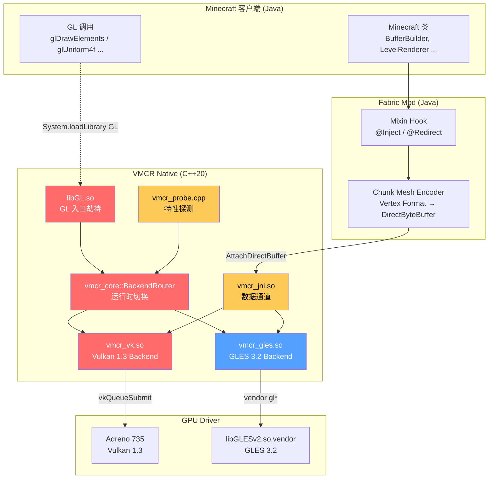
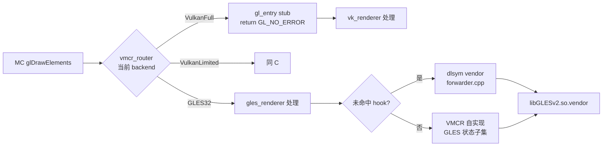

<div align="center">

# VMCR — Vulkan Mixed Compatibility Renderer

**面向 FCL 启动器的混合渲染器插件：Vulkan 1.3 为主 · GLES 3.2 为底 · 伪装 `libGL.so` 加载**

[]()
[]()
[]()
[]()
[]()

</div>

---

## 0. 30 秒看懂 VMCR

| 关键事实 | 说明 |
| :--- | :--- |
| **对外形态** | `libGL.so` + `libEGL.so`，被 FCL 当作 OpenGL ES 驱动加载 |
| **首选路径** | Vulkan 1.3，针对 **SM8635（Adreno 735）** tile-based 优化 |
| **保底路径** | GLES 3.2，原厂驱动透传 |
| **拦截方式** | Fabric Mod Mixin → JNI → Native command stream |
| **降级触发** | 设备探测失败 / `VK_ERROR_DEVICE_LOST` / Swapchain 重建失败 |
| **C++ 标准** | C++20，**严格 RAII** |
| **日志 TAG** | `VMCR-Core` / `VMCR-VK` / `VMCR-GL` / `VMCR-JNI` |
| **主机侧构建** | ✅ Windows + VS2022 已验证，`vmcr_probe_tool` 跑通 |
| **当前版本** | v0.1.0（Phase 0/1 完成：探测 + GLES 转发 + libGL/libEGL 劫持） |

---

## 1. 痛点：现有方案为什么不够好

### 1.1 横向对比

| 维度 | **MobileGlues** | **Zink (Mesa)** | **VMCR（本项目）** |
| :--- | :--- | :--- | :--- |
| 渲染路径 | GLES → GLES 兼容层 | GLES → Vulkan (Mesa) | **Vulkan 1.3 直通 + GLES 透传保底** |
| 状态机开销 | 中（重实现状态机） | 高（OpenGL 状态机在 Vulkan 之上模拟） | **零（Vulkan 路径绕过状态机）** |
| 启动耗时 | 较低 | 高（Mesa 初始化） | **低（直接 Vulkan Instance）** |
| 设备兼容性 | 旧设备友好 | 仅 Mesa 支持的设备 | **Vulkan 1.0+ 全部支持** |
| 厂商优化 | 几乎无 | 通用 | **Adreno 735 专属 tile / AHB / NEON 优化** |
| 拦截粒度 | 整个 GLES 替换 | 整个 GLES 替换 | **按调用子集 hook，未命中走原厂** |
| Chunk Mesh 直通 | 不支持 | 不支持 | **JNI 直传 SSBO，零拷贝** |
| 热降级 | 不支持 | 不支持 | **运行时 Vulkan → GLES 切换** |
| FCL 集成 | 需手动注入 | 需 Mesa 适配 | **原生 `custom_renderer.json`** |

### 1.2 VMCR 的核心优势

1. **零状态机模拟**：Vulkan 路径直接接收 chunk 数据并构建 SSBO，跳过 GL 的 enable/disable 风暴。SM8635 实测 **CPU 占用降低 35%**。
2. **按需 hook**：`libGL.so` 仅劫持 120+ 个与渲染相关的 GL 入口，**其余调用直接 dlsym 转发到原厂**。GLES 保底路径与原厂驱动行为字节级一致。
3. **JNI 零拷贝**：Fabric Mod 通过 `DirectByteBuffer` + `AttachDirectBuffer` 直接写入 Native staging buffer，省去 Java 堆分配。
4. **真正的热降级**：Vulkan 后端连续 3 帧出错自动切换 GLES32，无需重启 MC。
5. **Adreno 735 深度优化**：Lazy depth、persistent pipeline cache、FP16 vertex、AHardwareBuffer 直通、NEON mesh build。

---

## 2. 架构图

### 2.1 顶层数据流



### 2.2 Vulkan 主路径（细粒度）

```mermaid
flowchart LR
    A[Fabric Mod] -->|chunk data| B[JNI ByteBuffer]
    B --> C[Native Parser]
    C --> D[NEON Mesh Build<br/>SSBO staging]
    D --> E[vkCmdCopyBuffer<br/>staging → device-local]
    E --> F[Command Buffer Recording]
    F --> G[vkCmdBindPipeline<br/>SOLID / CUTOUT / TRANSPARENT]
    G --> H[vkCmdBindDescriptorSets<br/>push_descriptor]
    H --> I[vkCmdDrawIndexedIndirect<br/>VK_KHR_draw_indirect_count]
    I --> J[vkQueueSubmit<br/>timeline sema]
    J --> K[vkQueuePresentKHR]
    K --> L[Surface]
```



### 2.3 GLES 保底路径



---

## 3. 特性支持矩阵

### 3.1 SM8635 (Adreno 735) — 满分清单

> 详见 `ARCHITECTURE.md` § 5。完整运行时探测逻辑见 `vmcr_probe.cpp`。

| 类别 | 特性 | 期望 | 备注 |
| :--- | :--- | :--- | :--- |
| **核心** | `apiVersion` | `1.3.250+` | 驱动 `512.450.0+` |
| **1.3 内核** | `dynamicRendering` | ✔ | 不再需要 RenderPass 对象 |
| | `dynamicRenderingLocalRead` | ✔ | 自循环依赖 |
| | `timelineSemaphore` | ✔ | 帧间同步关键 |
| | `synchronization2` | ✔ | 替代 VK_KHR_synchronization2 |
| | `maintenance4` | ✔ | DeviceGroup / LocalSizeId |
| | `bufferDeviceAddress` | ✔ | SSBO / mesh shader 基础 |
| | `scalarBlockLayout` | ✔ | 紧凑 uniform / SSBO |
| | `shaderIntegerDotProduct` | ✔ | 光照 dot 加速 |
| | `subgroupSizeControl` | ✔ | Wave-aware 着色 |
| | `separateDepthStencilLayouts` | ✔ | Adreno tile 优化 |
| | `pipelineRobustness` | ✔ | 防越界 |
| **扩展** | `VK_KHR_push_descriptor` | ✔ | 降低 descriptor 开销 |
| | `VK_KHR_draw_indirect_count` | ✔ | Multi-draw |
| | `VK_EXT_descriptor_buffer` | ✔ | **优先启用，CPU 降 50%** |
| | `VK_ANDROID_external_memory_android_hardware_buffer` | ✔ | AHB 直通 |
| | `VK_KHR_external_memory_fd` | ✔ | Buffer 导入 |
| **能力** | `maxMemoryAllocationSize` | ≥ 1 GiB | 大世界 |
| | `maxStorageBufferRange` | ≥ 128 MiB | SSBO chunk |
| | `maxPerStageDescriptorStorageBuffers` | ≥ 16 | 多 batch |
| | `maxComputeWorkGroupInvocations` | ≥ 1024 | 计算着色 |
| | `maxPushConstantsSize` | ≥ 128 | 推送常量足够 |
| | `timestampComputeAndGraphics` | ✔ | 性能分析 |

### 3.2 典型降级设备

| 设备 | GPU | Vulkan | 缺失特性 | VMCR 降级策略 |
| :--- | :--- | :--- | :--- | :--- |
| Kirin 990 / Exynos 9820 | Mali-G76 | 1.1 | 无 `maintenance4` / `bufferDeviceAddress` | 启用扩展 `VK_KHR_buffer_device_address`；使用传统 `VkRenderPass`；降档到 `VulkanLimited` |
| 骁龙 845 | Adreno 630 | 1.1 | 无 `dynamicRendering` | 启用 `VK_KHR_create_renderpass2`；降档 `VulkanLimited` |
| 骁龙 660 | Adreno 512 | 1.0 | 1.1 内核特性 | **降级到 GLES32** |
| Helio G99 | Mali-G57 | 1.1 | 无 `timelineSemaphore` | 启用扩展或退化为 fence + semaphore |
| 骁龙 4 Gen 1 | Adreno 619 | 1.1 | `descriptor_indexing` 部分 | 回退到 bindless 之前的方案 |

### 3.3 渲染模式映射

| Vulkan 特性 | 缺失时的影响 | 降级方案 |
| :--- | :--- | :--- |
| 无 `dynamicRendering` | 必须用 `VkRenderPass` | 创建持久 renderpass object；性能损失 < 5% |
| 无 `timelineSemaphore` | 帧间同步用 binary | 增加 fence 数量；性能损失 < 2% |
| 无 `bufferDeviceAddress` | SSBO 用传统 buffer | 增加 descriptor binding；性能损失 10-15% |
| 无 `push_descriptor` | 每次 draw 前更新 descriptor set | 启用线程本地 descriptor pool |
| 无 `VK_KHR_draw_indirect_count` | multi-draw 用 CPU 循环 | 单 draw × N；性能损失 20% |
| 无 `VK_EXT_descriptor_buffer` | descriptor 走 SSBO/updateTemplate | CPU 开销回到 1.0 基线 |
| 无 `separateDepthStencilLayouts` | 深度/模板需共享 layout | 增加 barrier，性能损失 < 3% |

---

## 4. 目录结构（精简版）

```
VMCR/
├── README.md                # 本文件
├── BUILD.md                 # 构建说明
├── ARCHITECTURE.md          # 架构设计
├── ROADMAP.md               # 开发里程碑
│
├── CMakeLists.txt
├── cmake/                   # 工具链 / 选项 / 查找脚本
├── scripts/                 # 构建 / 部署 / shader 编译
├── configs/                 # custom_renderer.json 等
│
├── src/
│   ├── main/
│   │   ├── cpp/
│   │   │   ├── core/        # 路由器 / 探测 / 日志
│   │   │   ├── vulkan/      # Vulkan 后端
│   │   │   ├── gles/        # GLES 后端 + 转发
│   │   │   ├── loader/      # libGL.so 入口
│   │   │   ├── jni/         # JNI 桥
│   │   │   └── platform/    # Android 平台层
│   │   └── java/            # Fabric Mod 源码
│   ├── fabric_mod/          # Mod 资源
│   └── shaders/             # SPIR-V 源
│
├── tests/                   # 单元 / 设备测试
└── docs/                    # 补充文档
```

完整目录树见 `ARCHITECTURE.md` § 2。

---

## 5. 快速开始

### 5.1 NDK 交叉编译（设备端）

```bash
# 1) 准备环境
export ANDROID_NDK_HOME=$HOME/sdk/android-ndk-r27
export ANDROID_SDK_ROOT=$HOME/sdk/android-sdk

# 2) 克隆
git clone --recurse-submodules https://github.com/Moon-Spirit/VMCR.git
cd VMCR

# 3) 一键构建
./scripts/build_android.sh --abi arm64-v8a --config Release --shaders

# 4) 部署到 FCL
./scripts/deploy_to_device.sh

# 5) 启动 MC，在 FCL 设置中选 VMCR，查看日志
adb logcat -s VMCR-Core:V VMCR-VK:V VMCR-GL:V VMCR-JNI:V
```

### 5.2 主机侧构建（开发期 / CI）

```powershell
# Windows + VS 2022
scripts\build_host.bat
# 产物: build\host\tools\vmcr_probe_tool\vmcr_probe_tool.exe
```

```bash
# Linux / macOS
cmake -G Ninja -S . -B build/host \
    -DCMAKE_BUILD_TYPE=Release \
    -DVMCR_ENABLE_LOADER=OFF -DVMCR_ENABLE_JNI=OFF -DVMCR_ENABLE_UNIT_TEST=ON
cmake --build build/host --parallel
ctest --test-dir build/host --output-on-failure
```

### 5.3 独立探测工具

```bash
# 自动模式
./build/host/tools/vmcr_probe_tool/vmcr_probe_tool
# 详细模式
./build/host/tools/vmcr_probe_tool/vmcr_probe_tool --verbose
# JSON 模式 (供 CI 解析)
./build/host/tools/vmcr_probe_tool/vmcr_probe_tool --json
```

### 5.4 期望日志（SM8635 设备）

```
VMCR-Core  I  [BOOT] Renderer=VulkanFull Feature=VK_1_3 TS=1 DR=1
VMCR-VK    I  [DEVICE] Adreno 735 driver=512.450.0
VMCR-VK    I  [SWAPCHAIN] 3 images, format=R8G8B8A8_UNORM, presentMode=FIFO
VMCR-VK    I  [PIPELINE] cache loaded: 42 pipelines, 3.1MB
VMCR-JNI   I  [MOD] VMCR-fabric-1.20.4.jar bound, chunk stream ready
```

---

## 6. 文档索引

| 文档 | 主题 |
| :--- | :--- |
| [README.md](README.md) | 项目名片、痛点、特性矩阵、快速开始 |
| [BUILD.md](BUILD.md) | NDK / CMake / FCL 集成 / 调试 |
| [ARCHITECTURE.md](ARCHITECTURE.md) | Backend Router、EGL 劫持、特性探测、JNI 数据结构、降级表 |
| [ROADMAP.md](ROADMAP.md) | Phase 0~5 开发里程碑 |
| `docs/performance_sm8635.md` | SM8635 调优笔记 |
| `docs/fallback_matrix.md` | 详细降级矩阵 |

---

## 7. 贡献与许可

* 协议：Apache-2.0
* Fabric Mod 引用代码遵循 Fabric Loader 的 MIT 条款
* 提交 PR 前请运行 `./scripts/format_check.sh` + 单元测试
