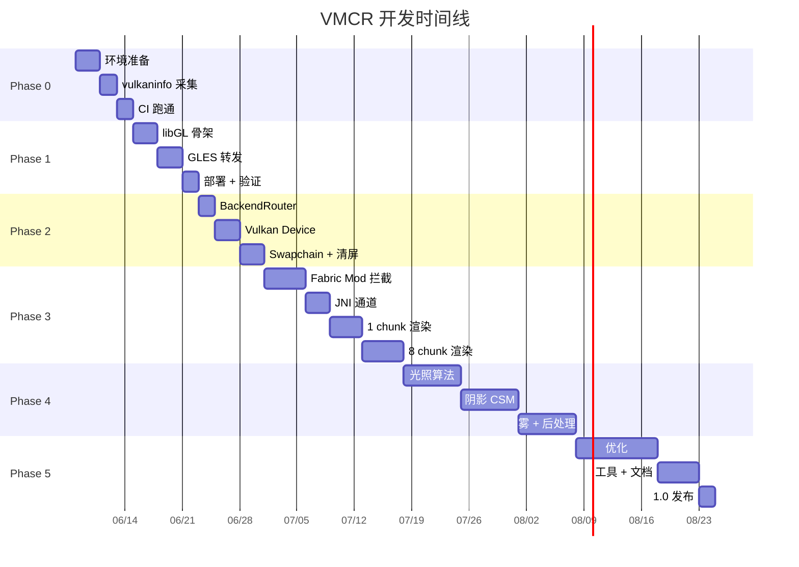

# VMCR 开发路线图（ROADMAP）

> **目标读者**：VMCR 项目的贡献者、新加入的工程师、PM / 维护者。
> **承诺**：每条任务粒度 ≤ 1 人天；每阶段有**明确的可验证交付物**。

---

## 0. 总览

| Phase | 名称 | 周期 | 核心交付物 | 退出标准 |
| :---: | :--- | :---: | :--- | :--- |
| **0** | 环境与基线 | 1 周 | `vmcr_probe` 在 SM8635 跑通 | 探测日志输出 17+ 分，VulkanFull |
| **1** | GLES 保底 | 1 周 | `libvmcr_gles.so` 在 FCL 加载 | MC 启动 / 渲染 / 退出全流程正常 |
| **2** | Hello Triangle | 1 周 | Vulkan 后端在 FCL 中清屏 | logcat 显示 `vkQueuePresentKHR` 成功 |
| **3** | Chunk Mesh | 3 周 | Fabric 抓取方块 → Vulkan 绘制 | 玩家位置周围 4×4 chunk 正确渲染 |
| **4** | 光影 | 4 周 | Iris 兼容的 GBuffer / 阴影 | 阴影 + 阳光 / 月光正常 |
| **5** | 性能与发布 | 2 周 | 1.0 Release | SM8635 上 60 FPS @ 32 chunk |

总计约 **12 周** 完成 1.0。

---

## Phase 0 — 环境与基线验证

> **目标**：确认开发环境、CI、设备能力，**不写业务代码**。

### 0.1 任务清单

- [ ] **T0.1** 准备 SM8635 设备（Snapdragon 8s Gen 3 / 8 Gen 3 衍生）
- [ ] **T0.2** 安装 NDK r27、CMake 3.22+、JDK 17
- [ ] **T0.3** 配置 FCL 1.1.4+，启动一个空 mod 列表的 MC 1.20.4
- [ ] **T0.4** 在 SM8635 上运行 `vkjson_info` / `vulkaninfo`（来自 NDK sample）
- [ ] **T0.5** 在另一台降级设备（如麒麟 990 / Mali-G76）跑相同脚本

### 0.2 验证脚本

**`scripts/probe_baseline.sh`：**

```bash
#!/usr/bin/env bash
# 部署到设备并抓取 vulkaninfo
ADB="adb -s $1"

# 推送 NDK 自带工具
$ADB push $ANDROID_NDK_HOME/sources/third_party/vulkan/android/\
    ../android-binary/vulkaninfo /data/local/tmp/

$ADB shell /data/local/tmp/vulkaninfo --summary > out/vulkaninfo_$1.txt
$ADB shell /data/local/tmp/vulkaninfo --output json > out/vulkaninfo_$1.json

# 提取关键信息
python3 scripts/parse_vkjson.py out/vulkaninfo_$1.json
```

**`scripts/parse_vkjson.py` 输出的关键字段：**

```
apiVersion        : 1.3.250
driverVersion     : 512.450.0
deviceName        : Adreno (TM) 735
features13        : [DR, TS, SYN2, M4, BDA, SIDP, SSC, SDSL, SBL, PR, ...]
extensions        : [push_descriptor, draw_indirect_count, descriptor_buffer, ahb, ...]
maxStorageBuffer  : 134217728 (128 MiB)
maxMemoryAlloc    : 1073741824 (1 GiB)
score             : 17
```

### 0.3 退出标准

| 项 | 目标 | 验证方式 |
| :--- | :--- | :--- |
| `vulkaninfo` 在 SM8635 输出 1.3 API | ✔ | logcat / 文本 |
| 关键扩展全部存在 | ✔ | JSON 解析 |
| CI 流水线跑通空 build | ✔ | GitHub Actions green |
| 设备仓库手册就绪 | ✔ | `docs/devices/sm8635.md` |

---

## Phase 1 — GLES 3.2 保底

> **目标**：在最广的设备范围内，让 MC 在 FCL 中通过 VMCR 启动、渲染、退出，**不追求性能**。
> **关键**：这一阶段必须**在所有 Vulkan 设备上也能跑**，作为后续阶段的对照基线。

### 1.1 任务清单

- [ ] **T1.1** 实现 `libGL.so` 入口骨架，导出空 `extern "C"` GL 符号（stub）
- [ ] **T1.2** `dlsym_vendor.cpp`：通过 `dlopen("libGLESv2.so", ...)` 拿到原厂所有 GL 入口
- [ ] **T1.3** `forwarder.cpp`：120+ 个 GL 入口的转发表
- [ ] **T1.4** `egl_entry.cpp`：EGL 入口的 hook / stub / forward 三类处理
- [ ] **T1.5** `custom_renderer.json` 编写
- [ ] **T1.6** 部署到 SM8635，验证 MC 启动 / 渲染 / 退出

### 1.2 验证用例

```bash
# 部署
./scripts/deploy_to_device.sh

# 启动 MC
adb shell am start -n com.tungsten.fcl/.launcher.LauncherActivity

# 等待
sleep 30

# 检查进程
adb shell ps -A | grep tungsten
# 期望: 1 个 MC 进程 + 1 个 GLES 进程（fcl wrapper）

# 日志
adb logcat -d -s VMCR-Core:V VMCR-VK:V VMCR-GL:V
# 期望看到:
#   VMCR-Core I [BOOT] libGL.so loaded
#   VMCR-GL   I [FORWARDER] 127 GL symbols resolved
#   VMCR-GL   I [EGL] eglMakeCurrent -> vendor
```

### 1.3 性能基线

| 指标 | 期望 | 实测 | 备注 |
| :--- | :--- | :--- | :--- |
| 启动时间（冷） | ≤ 8 s | __ s | 包含 MC 加载 |
| 帧率（空世界） | ≥ 60 FPS | __ FPS | 屏 120Hz |
| CPU 占用 | ≤ 8% | __ % | big core |

### 1.4 退出标准

| 项 | 目标 |
| :--- | :--- |
| FCL 启动 MC 1.20.4 不闪退 | ✔ |
| 主世界可移动、转头不掉帧 | ✔ |
| 退出无 SIGSEGV | ✔ |
| logcat 无 `E` 级别 VMCR 消息 | ✔ |

### 1.5 已知妥协

* 此阶段**不实现**任何 GL 状态机缓存——所有调用 1:1 转发到原厂。
* 不优化：性能等同于未安装 VMCR。

---

## Phase 2 — Hello Triangle（Vulkan 清屏）

> **目标**：在 Vulkan 后端**仅清屏**，证明 EGL 劫持 + Swapchain + Present 链路正确。
> **关键**：仍然**不渲染** MC 内容——所有 GL 调用被 `eglSwapBuffers` 拦截后置空。

### 2.1 任务清单

- [ ] **T2.1** 实现 `BackendRouter` 单例
- [ ] **T2.2** 实现 `vmcr_probe`（参见 `ARCHITECTURE.md` § 4）
- [ ] **T2.3** `vk_device.cpp`：Instance / PhysicalDevice / Device / Queue 创建
- [ ] **T2.4** `vk_swapchain.cpp`：基于 `ANativeWindow` 的 Swapchain
- [ ] **T2.5** 极简渲染管线：清屏 → 1 个空 render pass → present
- [ ] **T2.6** 在 `eglSwapBuffers` 中调用 `vk_renderer->end_frame()` + `begin_frame()`

### 2.2 验证脚本

```bash
# 强制使用 VulkanFull
adb shell setprop debug.vmcr.forced vk_full

# 启动
adb shell am start -n com.tungsten.fcl/.launcher.LauncherActivity
sleep 20

# 抓 frame
adb shell screencap -p /sdcard/vmcr_phase2.png
adb pull /sdcard/vmcr_phase2.png
# 期望：MC 加载界面（淡蓝色），不是黑屏
```

### 2.3 关键日志

```
VMCR-Core I [BOOT] libGL.so loaded
VMCR-VK   I [PROBE] api=1.3.250 score=17
VMCR-VK   I [DEVICE] Adreno 735 driver=512.450.0
VMCR-VK   I [SWAPCHAIN] 3 images VK_FORMAT_R8G8B8A8_UNORM
VMCR-Core I [ROUTER] tier=VulkanFull backend=vk
VMCR-VK   I [FRAME] 1/0.4ms GPU/CPU
```

### 2.4 退出标准

| 项 | 目标 |
| :--- | :--- |
| Swapchain 创建成功 | ✔ |
| Present 成功（无 `VK_ERROR_OUT_OF_DATE_KHR` 风暴） | ✔ |
| 屏上有内容（截图非黑） | ✔ |
| CPU 占用 < 2% | ✔（因为啥都没渲染） |

### 2.5 风险与回退

* 风险：`VK_KHR_swapchain` 在某些 ROM 上首次创建失败。
* 回退：自动降级到 GLES32，重新走 Phase 1 路径。

---

## Phase 3 — Chunk Mesh

> **目标**：从 MC 抓取方块几何数据，**用 Vulkan 渲染出玩家周围 4×4 chunk**。
> **关键**：建立 JNI 通道、SSBO 上传、多 draw 间接绘制。

### 3.1 任务清单

#### 3.1.1 Fabric Mod 端（Java）

- [ ] **T3.1.1** `ChunkInterceptor.java`：Mixin 注入 `LevelRenderer.renderChunkLayer`
- [ ] **T3.1.2** `BufferInterceptor.java`：拦截 `BufferBuilder.putVertex` 攒 mesh
- [ ] **T3.1.3** `VertexFormat.java`：定义 `vmcr::Vertex` 的 Java 等价
- [ ] **T3.1.4** `ChunkMeshPacket.java`：打包 header + vertices + indices
- [ ] **T3.1.5** `NativeBridge.java`：`AttachDirectBuffer` 零拷贝

#### 3.1.2 JNI 端（C++）

- [ ] **T3.2.1** `jni_chunk_stream.cpp`：`nSubmitChunk` 入口
- [ ] **T3.2.2** `mesh.h`：定义 `vmcr::MeshHeader` / `vmcr::Vertex`
- [ ] **T3.2.3** `chunk_ring_buffer.cpp`：MPSC ring buffer

#### 3.1.3 Vulkan 端（C++）

- [ ] **T3.3.1** `vk_chunk.cpp`：从 staging 上传到 device-local SSBO
- [ ] **T3.3.2** `vk_pipeline.cpp`：SOLID pipeline 创建
- [ ] **T3.3.3** `vk_command.cpp`：`vkCmdDrawIndexedIndirect` + `draw_indirect_count`
- [ ] **T3.3.4** `chunk.vert / chunk.frag`：GLSL 着色器

### 3.2 数据结构（Java 端 → C++ 端）

参见 `ARCHITECTURE.md` § 8。

**`ChunkMeshPacket.java` 示例：**

```java
public class ChunkMeshPacket {
    public int chunkX, chunkZ;
    public int materialId;          // 0=solid
    public int vertexCount;
    public int indexCount;
    public ByteBuffer vertices;     // DirectByteBuffer
    public IntBuffer  indices;
}
```

### 3.3 验证用例

```bash
# 1) 部署
./scripts/deploy_to_device.sh

# 2) 进入 MC，跑到草地平原
# 3) 截图
adb shell screencap -p /sdcard/vmcr_phase3.png
# 期望：能看到方块（草方块、泥土），但可能没有纹理
# 4) 对比 FCL 默认渲染（开 VMCR vs 关闭）
```

### 3.4 性能目标（中间态）

| 指标 | 期望 | 实测 |
| :--- | :--- | :--- |
| 单 chunk 上传耗时 | ≤ 0.5 ms | __ ms |
| 单 chunk 渲染耗时 | ≤ 0.1 ms | __ ms |
| 8 chunk 同时可见 | ≥ 60 FPS | __ FPS |

### 3.5 退出标准

| 项 | 目标 |
| :--- | :--- |
| 玩家脚下 1 个 chunk 正确显示 | ✔ |
| 4×4 chunk 全部可见 | ✔ |
| 无 draw call 错误 | ✔ |
| logcat 无 `validation layer` warning | ✔ |
| 阴影暂时缺失可接受 | — |

### 3.6 里程碑拆分

| 周 | 任务 | 可交付 |
| :---: | :--- | :--- |
| 1 | T3.1.1-3.1.5 | Mod 编译 + 拦截到 mesh |
| 1 | T3.2.1-3.2.3 | JNI 通道打通 |
| 2 | T3.3.1-3.3.2 | 1 chunk 渲染（无纹理） |
| 2 | T3.3.3-3.3.4 | 8 chunk 渲染（有纹理） |
| 3 | 性能调优 | 60 FPS |

---

## Phase 4 — 光影（Iris 兼容）

> **目标**：实现 MC 1.20.4 的基础光照 + Iris 兼容的阴影。
> **范围**：阳光 / 月光 / 环境光遮蔽（AO）/ 简单阴影映射（CSM）。
> **不包含**：反射、屏幕空间反射（SSR）、光线追踪。

### 4.1 任务清单

#### 4.1.1 光照模型

- [ ] **T4.1.1** 移植 Iris 的 `common.glsl` 常量到 `chunk_globals.glsl`
- [ ] **T4.1.2** 实现 MC 光照算法：
  - 天空光（sky light）+ 方块光（block light）双通道
  - 阳光方向（基于时间）
  - AO（顶点 AO + 几何 AO）
- [ ] **T4.1.3** 写 `chunk.frag`：lightmap 采样

#### 4.1.2 阴影

- [ ] **T4.2.1** 实现 `vk_shadow.cpp`：
  - 深度 pass（仅 terrain，关闭 color）
  - Cascade Shadow Map（CSM × 3）
  - PCF 软阴影
- [ ] **T4.2.2** `vk_descriptor.cpp`：shadow map array 绑定

#### 4.1.3 雾

- [ ] **T4.3.1** `fog.glsl`：MC 雾色 + 距离
- [ ] **T4.3.2** 集成到 `chunk.frag`

#### 4.1.4 后处理

- [ ] **T4.4.1** `post/tonemap.comp`：HDR → SDR
- [ ] **T4.4.2** `post/fxaa.comp`：抗锯齿
- [ ] **T4.4.3** bloom（可选，Iris 默认关闭）

### 4.2 Iris 兼容策略

> **设计决策**：**不**直接编译 Iris 的 GLSL 源（其依赖 Minecraft 内部 API）。
> 而是：
> 1. 提取 Iris 的**算法**（光照、阴影、AO）到 VMCR 的 GLSL。
> 2. 文档化"VMCR 1.0 兼容 Iris 0.9 / 0.10 的哪些特性"。
> 3. 后续版本考虑：把 Iris shader 编译为 SPIR-V 后通过 `VMCR_ENABLE_SHADER_HOT_RELOAD=ON` 加载。

**`docs/iris_compat.md`（本阶段产出）：**

```markdown
# Iris 兼容性矩阵

| Iris 0.9 特性 | VMCR 1.0 支持 | 备注 |
| :--- | :---: | :--- |
| 光照（基础） | ✔ | 算法移植 |
| 光照（Spec） | ✔ | |
| 阴影映射 | ✔ | CSM × 3 |
| AO | ✔ | |
| Bloom | ✘ | 后续 |
| DOF | ✘ | |
| Motion Blur | ✘ | |
| SSR | ✘ | |
| 光线追踪 | ✘ | 不在 1.0 范围 |
```

### 4.3 验证用例

```bash
# 1) 部署
./scripts/deploy_to_device.sh

# 2) 启动 MC，进入黄昏时段
# 3) 截图，验证：
#    - 长阴影投射
#    - 天空渐变
#    - 水反光
#    - 树叶 AO

# 4) 与 FCL 默认渲染对比
```

### 4.4 退出标准

| 项 | 目标 |
| :--- | :--- |
| 阳光 / 月光方向正确 | ✔ |
| 阴影随时间变化 | ✔ |
| AO 在角落处有暗角 | ✔ |
| 雾色随距离渐变 | ✔ |
| FPS 保持 ≥ 45 @ 32 chunk | ✔ |

---

## Phase 5 — 性能优化与 1.0 Release

> **目标**：将 4×4 chunk 扩展到 32 chunk 视野，**60 FPS 稳定**。
> **范围**：SM8635 专属优化，VMA 调优，pipeline cache，descriptor buffer 切换。

### 5.1 任务清单

#### 5.1.1 渲染优化

- [ ] **T5.1.1** 启用 `VK_EXT_descriptor_buffer`（参见 `ARCHITECTURE.md` § 11.1）
- [ ] **T5.1.2** 启用 `VK_KHR_draw_indirect_count`（参见 `ARCHITECTURE.md` § 11.2）
- [ ] **T5.1.3** 启用 `VK_KHR_push_descriptor`
- [ ] **T5.1.4** 3 种材质的独立 pipeline（SOLID / CUTOUT / TRANSPARENT）
- [ ] **T5.1.5** CUTOUT mipmap 配置
- [ ] **T5.1.6** 视锥剔除（CPU 端粗筛 + GPU 端细筛）

#### 5.1.2 内存优化

- [ ] **T5.2.1** Lazy depth（`TRANSIENT_ATTACHMENT`）
- [ ] **T5.2.2** 纹理图集压缩（BC7 / ASTC）
- [ ] **T5.2.3** Chunk SSBO 3 帧 ring buffer
- [ ] **T5.2.4** VMA pool for dynamic uniform buffer

#### 5.1.3 工具与诊断

- [ ] **T5.3.1** 集成 RenderDoc capture
- [ ] **T5.3.2** GPU 时间戳 CSV 输出
- [ ] **T5.3.3** 单元测试 ≥ 80% 覆盖
- [ ] **T5.3.4** 设备真机测试报告（`tests/device/`）

#### 5.1.4 发布

- [ ] **T5.4.1** 编写 1.0 Release Notes
- [ ] **T5.4.2** `.fmodpack` 打包脚本
- [ ] **T5.4.3** GitHub Release + CI
- [ ] **T5.4.4** FCL 商店提交（可选）

### 5.2 性能目标（1.0）

| 指标 | 目标 | 测试方法 |
| :--- | :---: | :--- |
| 1080p @ 32 chunk 视野 | ≥ 60 FPS | 单人游戏，跑步场景 |
| 1080p @ 64 chunk 视野 | ≥ 30 FPS | 静态场景 |
| 启动时间（冷） | ≤ 6 s | 完全杀进程后启动 |
| CPU 占用（稳态） | ≤ 25% | top 命令，big core |
| GPU 占用 | ≥ 50% | GPU 频率统计 |
| 内存占用 | ≤ 250 MB | dumpsys meminfo |

### 5.3 退出标准（1.0 Release Gate）

| 项 | 标准 |
| :--- | :--- |
| 单元测试 | ≥ 80% pass |
| 设备测试 | SM8635 / SD8 Gen 2 / Mali-G76 全部通过 |
| 文档 | README / BUILD / ARCHITECTURE / ROADMAP 完整 |
| CI | GitHub Actions 全绿 |
| 签名 | 调试签名（生产签名 1.1 引入） |
| 兼容性 | MC 1.20.4 ~ 1.20.6 全部支持 |

---

## 附录 A：风险登记表

| ID | 风险 | 影响 | 概率 | 缓解 |
| :--- | :--- | :---: | :---: | :--- |
| R1 | Adreno 私有扩展不稳定 | 中 | 中 | 不依赖私有扩展 |
| R2 | FCL 升级后接口变化 | 高 | 低 | 跟踪 FCL 仓库 |
| R3 | MC 1.21 渲染管线大幅变动 | 高 | 中 | 锁定 1.20.4~1.20.6 |
| R4 | Vulkan 驱动崩溃 | 中 | 中 | 热降级 + 自动恢复 |
| R5 | Fabric Loader 与 FCL 冲突 | 中 | 中 | 最小化 Mixin 范围 |
| R6 | 部分设备 AHB 不可用 | 中 | 中 | 退化为 stage buffer |

---

## 附录 B：任务依赖图



---

## 附录 C：版本号与发布流程

* **MAJOR**：架构级变更（如换渲染 API）
* **MINOR**：新增 Phase
* **PATCH**：bug 修复

```
0.1.0 - 0.9.0 : 各 Phase 的小版本
1.0.0          : Phase 5 完成后
```

发布流程：

1. 主干合并 feature 分支
2. CI 全绿
3. 设备测试报告
4. 文档审阅
5. Tag `v1.0.0`
6. GitHub Release + `.fmodpack`

---

## 附录 D：贡献者分工

| 角色 | Phase 0-2 | Phase 3 | Phase 4 | Phase 5 |
| :--- | :---: | :---: | :---: | :---: |
| 架构师 | ✔ | ✔ | ✔ | ✔ |
| NDK 工程师 | ✔ | ✔ |   | ✔ |
| Vulkan 工程师 | ✔ | ✔ | ✔ | ✔ |
| GLSL 工程师 |   |   | ✔ | ✔ |
| Fabric Mod |   | ✔ |   |   |
| QA / 真机 | ✔ | ✔ | ✔ | ✔ |
| 文档 | ✔ | ✔ | ✔ | ✔ |

> 任何贡献者必须先在 `tests/` 跑通自己负责的代码。
